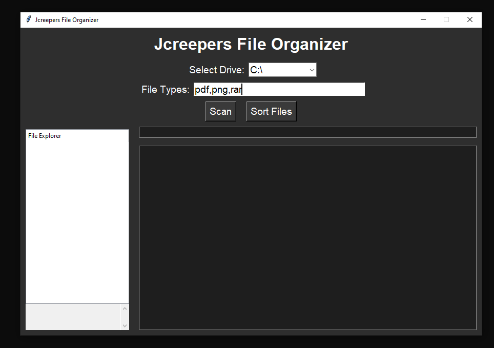

📁 File Organizer – Python GUI App
A sleek and professional Python GUI application that scans your drives for specific file types (e.g., PDFs, PNGs, RARs) and organizes them into folders by type. Includes a clickable file explorer tree, scrollable results view, and one-click sorting.

🚀 Features
Scan drives (C:/, D:/) for selected file types (default: .pdf, .png, .rar)
Displays found files in a scrollable list with full file paths
Expandable File Tree: Navigate through drives, folders, subfolders, and files
Click on files in the tree to view their full path
One-click sort: Automatically organize files into folders by type

📦 Installation
Clone the repository

git clone https://github.com/<your-username>/file-organizer.git
cd file-organizer

Install required packages
This app uses only Python’s standard library, so no external dependencies are required.
(Optional) Install tkinter if your system doesn’t have it:

pip install tk

🖥️ Screenshots
Scan Results	File Tree View

